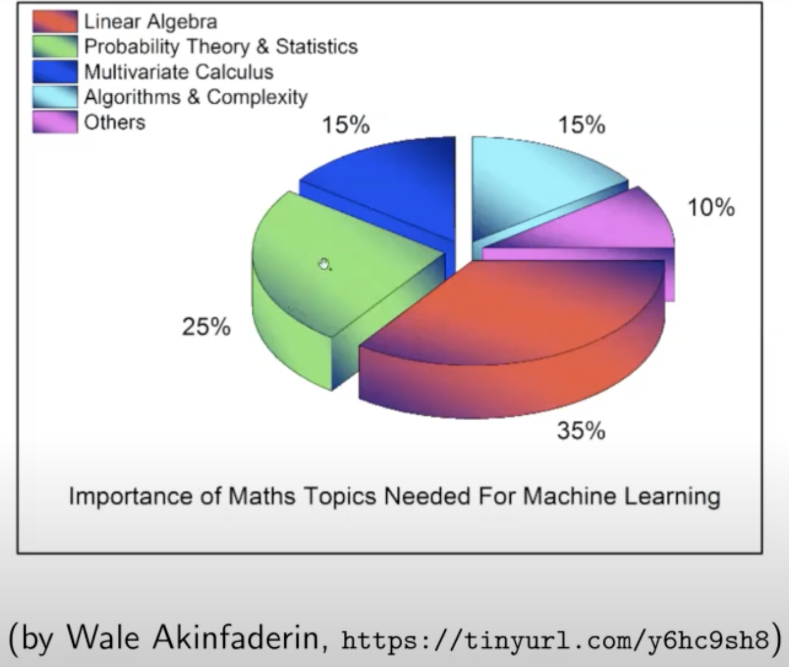

Tags: Machine_Learning
Date: 2020-04-01

# How Much Math Do You Need for Learning ML

For people who don't come from a mathematical background, math can be a big hurdle for following and learning ML. Recently, I came across this: 

https://www.youtube.com/watch?v=fPJIUYU63Rc

(more about Summer Schools later, in the mean time: I __highly__ recommend)

I saw this gem: 

The Source material is [here](https://towardsdatascience.com/the-mathematics-of-machine-learning-894f046c568) and it has a bunch of reasonable resources. Wish the chart was backed up by something more quantitate though. 

