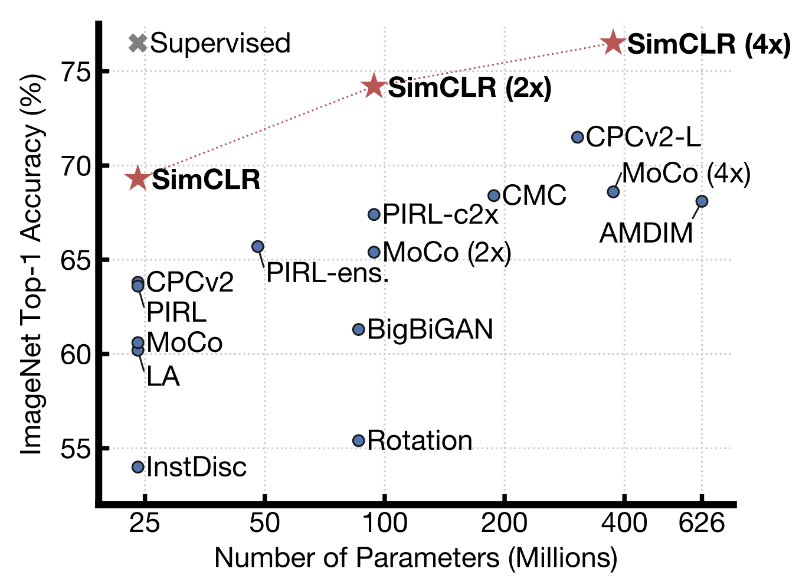

tags:	Machine_Learning

# SimCLR: (almost) beating Supervised Learning 

## Key Points: 
- Unsupervised Performance **almost** same as supvervised performance 
- Unsupervised performance scales with more parameters

### The paper: 
https://arxiv.org/pdf/2002.05709.pdf

### Video: 
https://www.youtube.com/watch?v=APki8LmdJwY

### Blog Posts: 
https://amitness.com/2020/03/illustrated-simclr/

